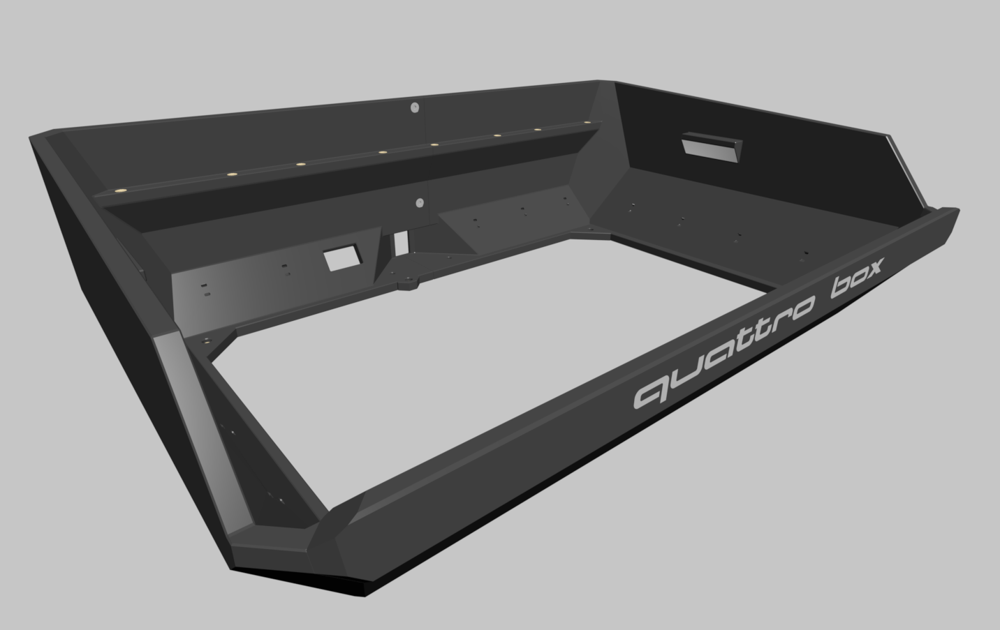
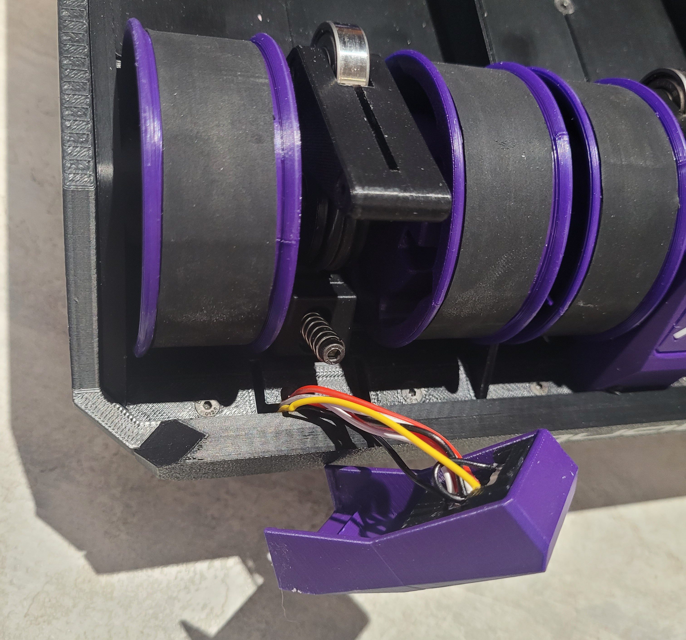

## Box

Insert the heat inserts into the [box_left](STLs/box/box_left.stl) and [box_right](STLs/box/box_right.stl) pieces as shown in the images above.

In the Bill of Materials (BOM), there are 4 heat inserts of 3mm that should be inserted into the sides:

- **Red**: Heat inserts M3x3x5
- **Blue**: Heat inserts M3x4x5

Use M3x5 FHCS screws to join the two parts.

Solder the 3 wires of the LED strip. Be very careful when handling the strip, as it is fragile. I recommend using AWG28 or 30 silicone wires, as they are more flexible.

Stick the LED strip onto the [mount_led_name](STLs/box/mount_led_name.stl) piece.

Insert the [mount_led_name](STLs/box/mount_led_name.stl) into the [name_led](STLs/box/[mmu]name_led.stl) until you hear a "click".

Position the assembly at the front of the box.

Use 4 M3x8 FHCS screws to secure the parts. These screws go directly into the plastic.

- **Green**: M3x8 FHCS screws
- **Purple**: Place to pass the LED cable

## Encoder Binky

Insert the 6 heat inserts into the [Encoder_bottom](STLs/encoder/[a]_Encoder_bottom.stl) piece.

In the [Encoder_top](STLs/encoder/[a]_Encoder_top.stl) piece:

- **Pink**: V623 bearing with M3x10 BHCS screw
- **Orange**: Binky wheel. If in doubt, refer to the [ERCFv2 manual](https://github.com/Enraged-Rabbit-Community/ERCF_v2/blob/master/Documentation/ERCF_v2_Manual.pdf) on page 95.
- **Red**: 4mm ball
- **Green**: Mount the D2F-L switch with 2 M2X10 BHCS screws
- **Blue**: Insert the ECAS

Join the two parts with 4 M3x16 BHCS screws. I recommend passing the filament through and checking if the Binky wheel is spinning correctly and if the switch is being activated correctly.

Mount the Binky board with M2X10 BHCS screws. Insert the output ECAS.

Save the piece, as we will use it in the next steps.

## Button Unload

In the [button_led_mount](STLs/button_unload/[o]button_led_mount_x4.stl) piece:

- **Green**: D2F switch. I recommend leaving it slightly loose at first and pushing it in during the final assembly of the button.
- **Blue**: RGBW LED (neopixel).

Solder the switch terminals at the back. The LEDs should be connected in series.

The button is composed of 3 parts (from left to right): [diffuser](STLs/button_unload/[c]led_diffuser_x4.stl) > [cover](STLs/button_unload/[o]led_cover_x4.stl) > [button](STLs/button_unload/[a]unload_button_x4.stl).

Insert the assembly above into the [button_cover](STLs/button_unload/[a]button_cover_x4.stl) piece.

Insert the [button_led_mount](STLs/button_unload/[o]button_led_mount_x4.stl) into the back until you hear a "click".

If necessary, move the switch in or out to ensure a smooth touch. Save the assembled parts, as we will place them in position later.

## Extruder

In the [extruder](STLs/extruder/extruder_x2.stl) and [extruder_mirror](STLs/extruder/extruder_mirror_x2.stl) pieces:

- Insert 3 heat inserts
- Insert the MR85 bearing (BMG Kit)
- Add the ECAS

In the [extruder_motor_base](STLs/extruder/extruder_motor_base_x2.stl) and [extruder_motor_base_mirror](STLs/extruder/extruder_motor_base_mirror_x2.stl) pieces:

- Insert 4 heat inserts
- Insert the MR85 bearing (BMG Kit)

Place the 50-tooth BMG gear and join the two pieces with M3x8 BHCS screws.

Insert the 4mm ball and the D2F-L switch with 2 M2X10 BHCS screws.

Check the alignment of the BMG gear and insert an M3x8 BHCS screw.

Insert the gear into the [latch](STLs/extruder/latch_x2.stl) and [latch_mirror](STLs/extruder/latch_mirror_x2.stl).

Assemble the latch with M3x25 BHCS screws.

If you opted for the Nema17, use 3 M3x10 BHCS screws with washers.

Be careful not to press the motor too hard against the 50-tooth gear. I recommend leaving a slight gap.

If you opted for the Nema 14, use 2 M3x10 BHCS screws with washers.

## Filamentalist

The assembly of the Filamentalist is quite similar to the original. I'll show a few steps, but if you have any questions, refer to the official page on [GitHub](https://github.com/Enraged-Rabbit-Community/ERCF_v2/tree/master/Recommended_Options/Filamentalist_Rewinder).

I recommend checking if your bearing slides easily on the 8mm shaft. There is a video made by SkiBike on troubleshooting the Filamentalist. Watch it before assembling [here](https://github.com/Enraged-Rabbit-Community/ERCF_v2/blob/master/Recommended_Options/Filamentalist_Rewinder/troubleshoot.md).

In the [Center_Drive_Roller](STLs/filamentalist/Center_Drive_Roller_x4.stl) piece, insert 2 O-rings and the HF081412 bearing.

Apply the EVA foam or rubber to the [Rim_Roller](STLs/filamentalist/[a]Rim_Roller_x8.stl). Then, insert the 8mm shaft into one side, place a [Spacer](STLs/filamentalist/Spacer_x8.stl), then insert [Center_Drive_Roller](STLs/filamentalist/Center_Drive_Roller_x4.stl), another [Spacer](STLs/filamentalist/Spacer_x8.stl), and finally another [Rim_Roller](STLs/filamentalist/[a]Rim_Roller_x8.stl).

Insert a 608zz bearing into one side of the tensioner. Join the [Tensioner_Arm_Left](STLs/filamentalist/Tensioner_Arm_Left_x4.stl) and [Tensioner_Arm_Right](STLs/filamentalist/Tensioner_Arm_Right_x4.stl) pieces with 2 M3x16 FHCS screws.

In the [lane_0_tensioner_mount_load](STLs/filamentalist/lane_0_tensioner_mount_load.stl), [lane_1_tensioner_mount_load](STLs/filamentalist/lane_1_tensioner_mount_load.stl), [lane_2_tensioner_mount_load](STLs/filamentalist/lane_2_tensioner_mount_load.stl) and [lane_3_tensioner_mount_load](STLs/filamentalist/lane_3_tensioner_mount_load.stl) pieces, insert a heat insert into each.

Mount the tensioners onto their supports with M3x16 FHCS screws. Insert the spring and M3x30 BHCS screws.

In the [lane_0_left_base](STLs/filamentalist/lane_0_left_base.stl), [lane_0_right_base](STLs/filamentalist/lane_0_right_base.stl), [lane_1_left_base](STLs/filamentalist/lane_1_left_base.stl), [lane_1_right_base](STLs/filamentalist/lane_1_right_base.stl), [lane_2_left_base](STLs/filamentalist/lane_2_left_base.stl), [lane_2_right_base](STLs/filamentalist/lane_2_right_base.stl), [lane_3_left_base](STLs/filamentalist/lane_3_left_base.stl) and [lane_3_right_base](STLs/filamentalist/lane_3_right_base.stl) pieces, insert a 608zz bearing into each.

Join the two parts of the idlers [Idler_Roller_female](STLs/filamentalist/[a]Idler_Roller_(female)_x4.stl) and [Idler_Roller_male](STLs/filamentalist/[a]Idler_Roller_(male)_x4.stl).

Insert 2 608zz bearings and insert the [Idler_Roller_Axle](STLs/filamentalist/Idler_Roller_Axle_x4.stl).

Now, join all the parts together. Secure the Idler and the tensioner with 3 M3x10 FHCS screws on each side, 2 M2x10 BHCS screws on the top, and 3 M2x10 BHCS screws on the bottom.

## Box Assembly

Mount the 4 Filamentalists to the box using 8 M3x16 FHCS screws at the front and 8 M3x6 BHCS screws at the back.

Mount the encoder at the bottom of the box using 2 M3x8 FHCS screws.

Separate the PTFE tubes into the following sizes:

- **Green**: 2 x 54mm
- **Orange**: 2 x 55mm
- **Blue**: 2 x 57mm
- **Pink**: 2 x 109mm

Place the PTFE tubes into the extruders and then install them from the bottom of the box, fitting the PTFE tubes into the Filamentalist and the encoder. Secure the extruders with 2 M3x8 FHCS screws from the top.

Pass the LED cables through the holes in the Filamentalist piece. Do not attach the button yet; leave it hanging by the wire, as you still need to calibrate the spring tension.

After assembling and calibrating everything, run the `rewinder_test_move` macro with a long distance (e.g., 1000mm) to check if the rewinding is working correctly.
- If the spool is tangling when pulling the filament, loosen the spring.
- If the spool is not rewinding the filament, tighten the spring.

After calibrating the spring, insert the button into the base, being careful not to damage the wires in the process.

Mount the [MMB_mount](STLs/eletronic_mount/MMB_mount.stl) piece with 4 M2x10 BHCS screws.

Mount the BTT MMB in the designated place.

## Electronics

Connect all the cables according to the layout above.

There are several places in the box where you can use zip ties to organize the wires.

If you want to connect the board via CANBUS, there is an extension plug that converts XT30+2 to microfit.

To assemble it, insert the microfit already with crimped cables into the [microfit_mount](STLs/eletronic_mount/[a]microfit_mount.stl) piece.

Pass the cables through the hole in the box from the outside to the inside and insert the [microfit_mount](STLs/eletronic_mount/[a]microfit_mount.stl).

To assemble the [box cover bottom](STLs/box/box_cover_bottom.stl), use M3x12 BHCS on the feet and 2 M3x8 FHCS screws in the middle.

