## Box

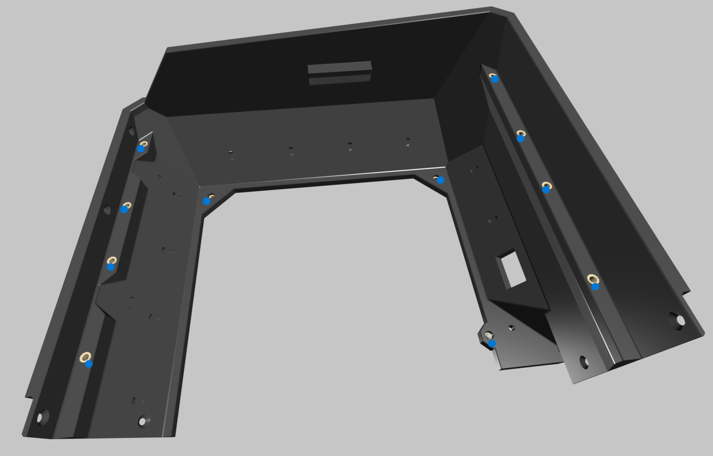

Insira os heat inserts nas peças [box_left](STLs/box/box_left.stl) e [box_right](STLs/box/box_right.stl) conforme mostrado nas imagens acima.

Na lista de materiais (BOM), há 4 heat inserts de 3mm que devem ser inseridos nas laterais:

- **Vermelho**: Heat inserts M3x3x5
- **Azul**: Heat inserts M3x4x5

Use parafusos M3x5 FHCS para unir as duas partes.

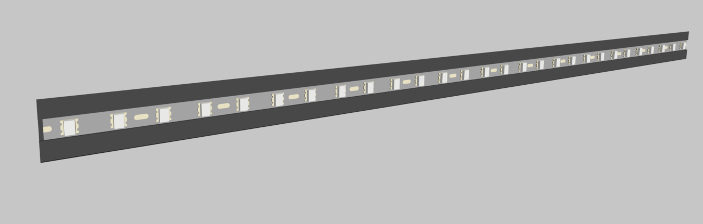

Solde os 3 cabos da fita de LED. Tome bastante cuidado ao manusear a fita, pois ela é frágil. Recomendo usar cabos de silicone AWG28 ou 30, pois são mais flexíveis. 

Cole a fita de LED na peça [mount_led_name](STLs/box/mount_led_name.stl).

Encaixe o [mount_led_name](STLs/box/mount_led_name.stl) na [name_led](STLs/box/[mmu]name_led.stl) até ouvir um "click".

Posicione o conjunto na frente da caixa.

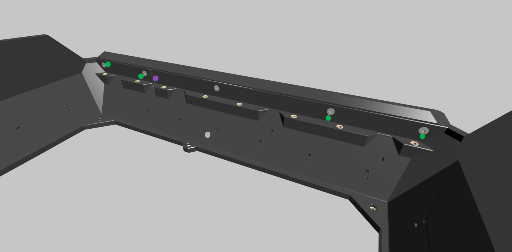

Use 4 parafusos M3x8 FHCS para fixar as partes. Esses parafusos vão diretamente no plástico.

- **Verde**: parafusos M3x8 FHCS
- **Roxo**: lugar para passar cabo do led

## Encoder Binky

Insira os 6 heat inserts na peça [Encoder_bottom](STLs/encoder/[a]_Encoder_bottom.stl).

Na peça [Encoder_top](STLs/encoder/[a]_Encoder_top.stl):

- **Rosa**: Rolamento V623 com parafuso M3x10 BHCS
- **Laranja**: Rodinha Binky. Se tiver dúvidas, consulte o [manual do ERCFv2](https://github.com/Enraged-Rabbit-Community/ERCF_v2/blob/master/Documentation/ERCF_v2_Manual.pdf) na página 95.
- **Vermelho**: Esfera de 4mm
- **Verde**: Monte o switch D2F-L com 2 parafusos M2X10 BHCS
- **Azul**: Coloque os ECAS

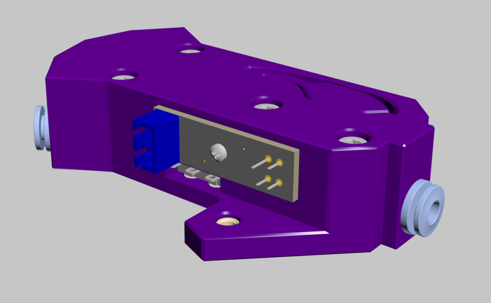

Una as duas partes com 4 parafusos M3x16 BHCS. Recomendo passar o filamento e verificar se a roda do Binky está girando corretamente e se o switch está sendo acionado corretamente.

Monte a placa do Binky com parafusos M2X10 BHCS. Coloque o ECAS de saída.

Guarde a peça, pois vamos usá-la nos próximos passos.

## Button Unload

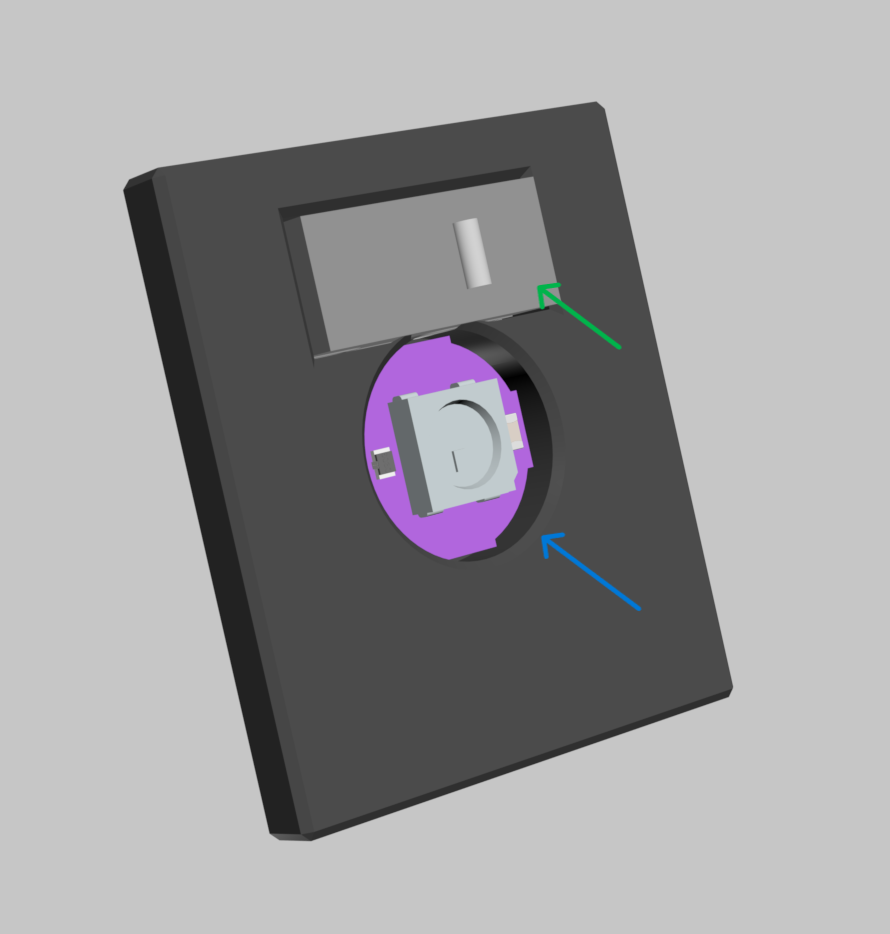

Na peça [button_led_mount](STLs/button_unload/[o]button_led_mount_x4.stl):

- **Verde**: Switch D2F. Recomendo deixar um pouco solto para fora e, na montagem final do botão, empurrá-lo para o fundo.
- **Azul**: LED RGBW (neopixel).

Solde as extremidades do switch na parte traseira. Os LEDs devem ser conectados em série.

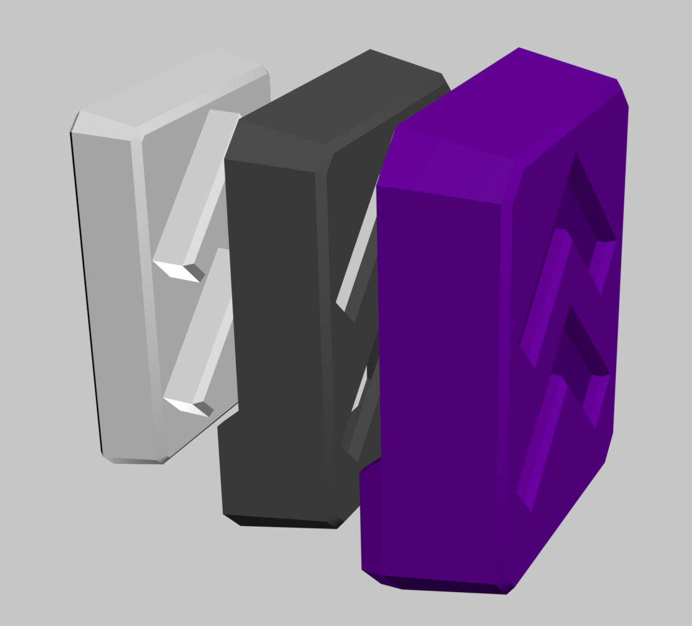

O botão é composto por 3 partes (da esquerda para a direita): [difusor](STLs/button_unload/[c]led_diffuser_x4.stl) > [cover](STLs/button_unload/[o]led_cover_x4.stl) > [button](STLs/button_unload/[a]unload_button_x4.stl).

Encaixe a montagem acima na peça [button_cover](STLs/button_unload/[a]button_cover_x4.stl).

Encaixe o [button_led_mount](STLs/button_unload/[o]button_led_mount_x4.stl) na parte traseira até ouvir um "click".

Se necessário, mova o switch para fora ou para dentro para garantir que o toque seja suave. Guarde as peças montadas, pois vamos colocá-las no lugar depois.

## Extruder

Nas peças [extruder](STLs/extruder/extruder_x2.stl) e [extruder_mirror](STLs/extruder/extruder_mirror_x2.stl):

- Coloque 3 heat inserts
- Insira o rolamento MR85 (BMG Kit)
- Adicione os ECAS

Nas peças [extruder_motor_base](STLs/extruder/extruder_motor_base_x2.stl) e [extruder_motor_base_mirror](STLs/extruder/extruder_motor_base_mirror_x2.stl):

- Coloque 4 heat inserts
- Insira o rolamento MR85 (BMG Kit)

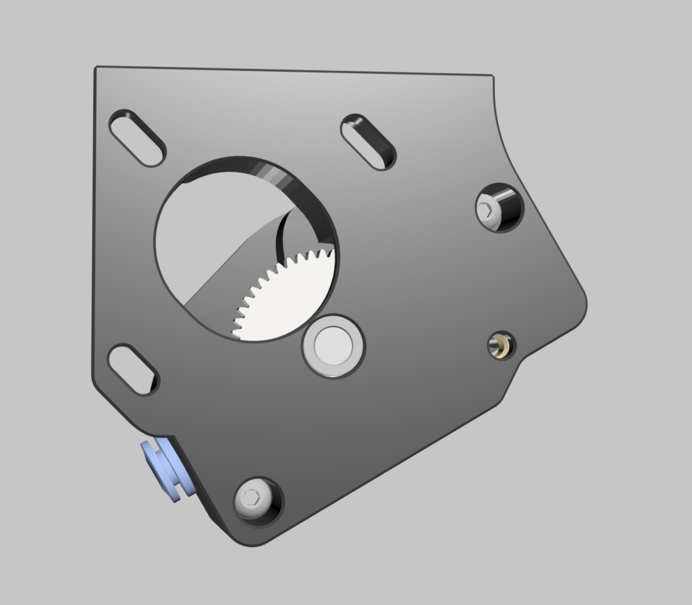

Coloque a engrenagem BMG de 50 dentes e una as duas peças com parafusos M3x8 BHCS.

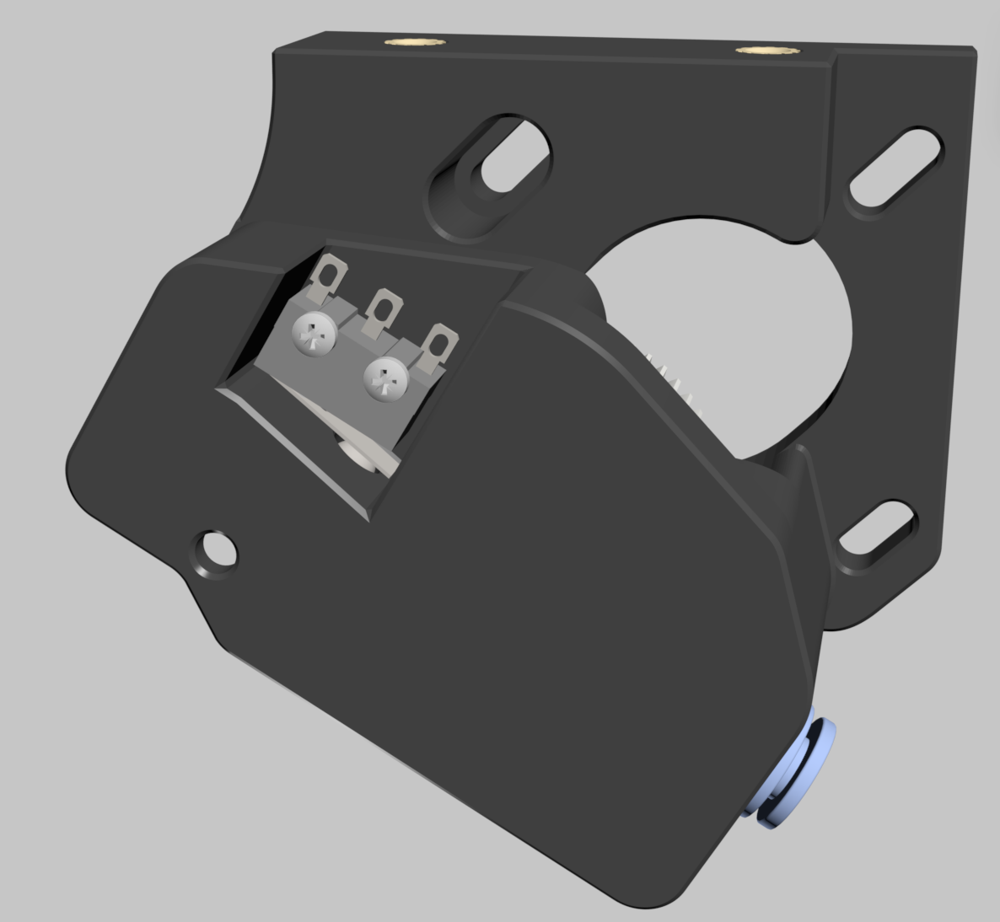

Coloque a esfera de 4mm e o switch D2F-L com 2 parafusos M2X10 BHCS.

Verifique o alinhamento da engrenagem BMG e coloque um parafuso M3x8 BHCS.

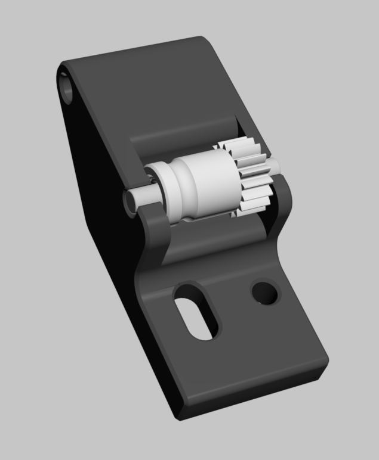

Encaixe a engrenagem no [latch](STLs/extruder/latch_x2.stl) e [latch_mirror](STLs/extruder/latch_mirror_x2.stl).

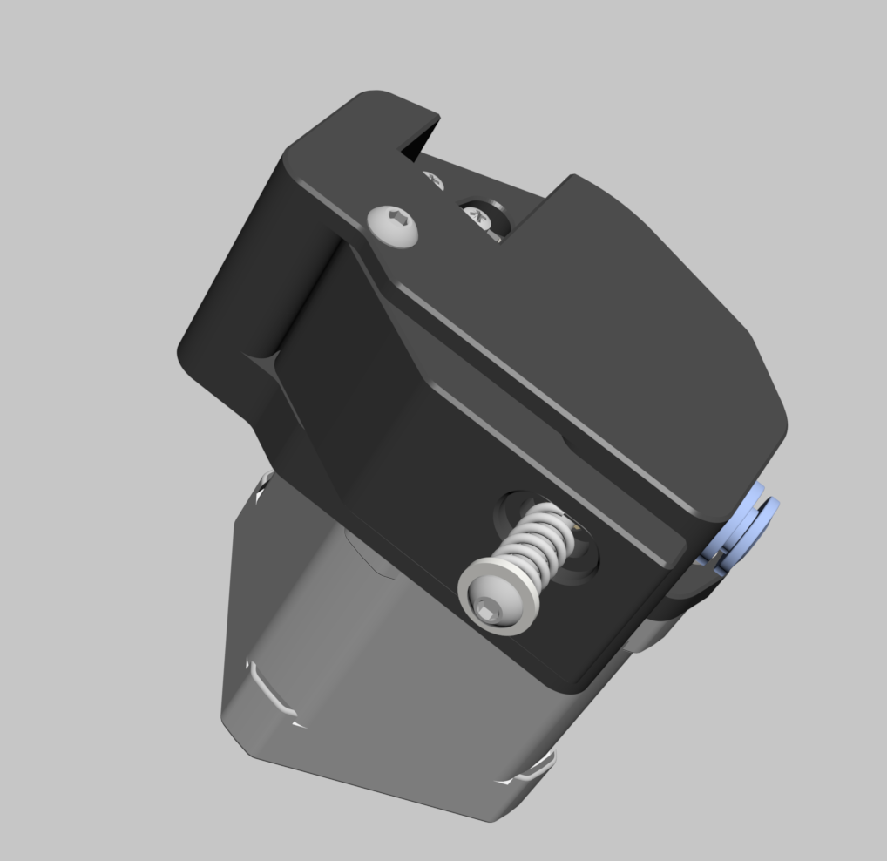

Monte o latch com parafusos M3x25 BHCS.

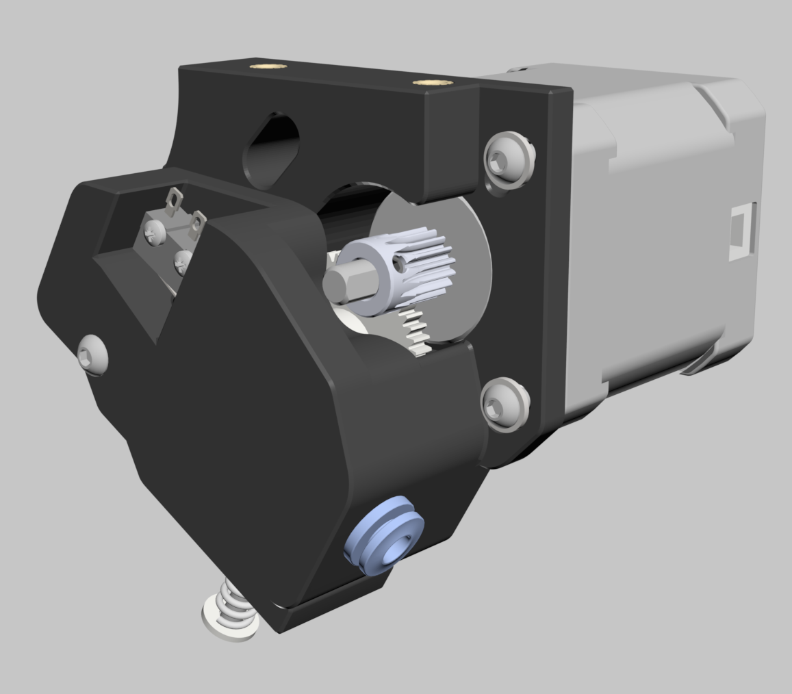

Se optou pelo Nema17, use 3 parafusos M3x10 BHCS com arruelas.

Tome cuidado para não pressionar demais o motor contra a engrenagem de 50 dentes. Recomendo deixar uma leve folga.

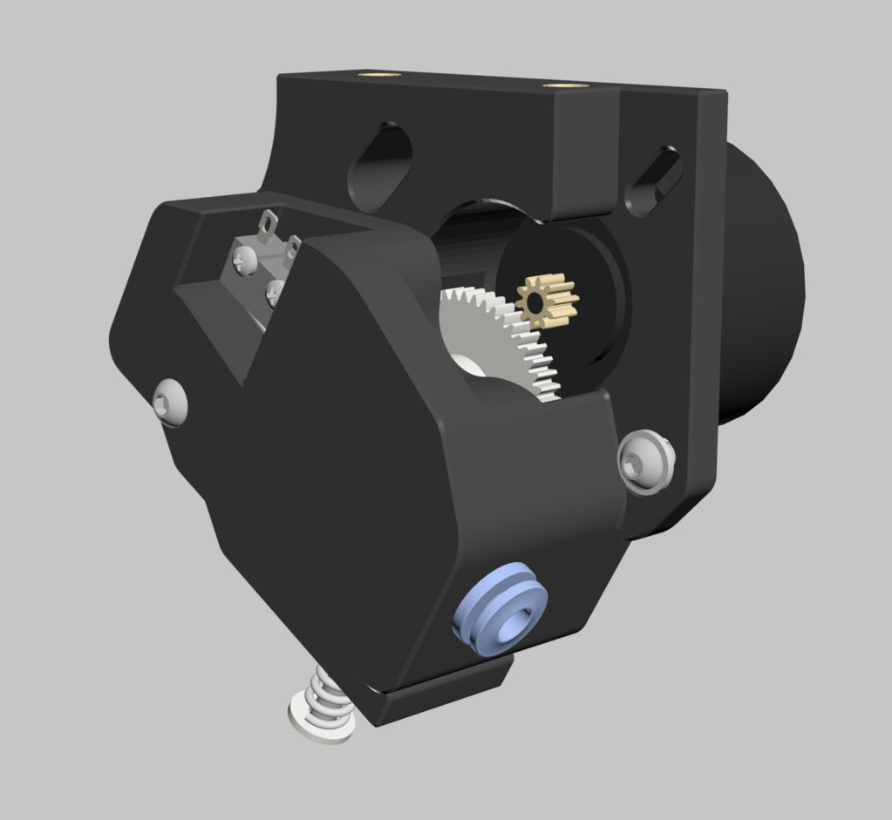

Se optou pelo Nema 14, use 2 parafusos M3x10 BHCS com arruelas.

## Filamentalist

A montagem do Filamentalist é bastante semelhante à original. Vou mostrar alguns passos, mas caso tenha alguma dúvida, consulte a página oficial no [GitHub](https://github.com/Enraged-Rabbit-Community/ERCF_v2/tree/master/Recommended_Options/Filamentalist_Rewinder).

Recomendo verificar se o seu rolamento desliza com facilidade no eixo de 8mm. Há um vídeo feito pelo SkiBike sobre soluções de problemas do Filamentalist. Veja antes da montagem [aqui](https://github.com/Enraged-Rabbit-Community/ERCF_v2/blob/master/Recommended_Options/Filamentalist_Rewinder/troubleshoot.md).

Na peça [Center_Drive_Roller](STLs/filamentalist/Center_Drive_Roller_x4.stl), insira 2 O'rings e o rolamento HF081412.

Coloque a fita EVA ou a borracha nos [Rim_Roller](STLs/filamentalist/[a]Rim_Roller_x8.stl). Depois, insira o eixo de 8mm em um lado, coloque um [Spacer](STLs/filamentalist/Spacer_x8.stl), então insira [Center_Drive_Roller](STLs/filamentalist/Center_Drive_Roller_x4.stl), outro [Spacer](STLs/filamentalist/Spacer_x8.stl) e, por fim, outro [Rim_Roller](STLs/filamentalist/[a]Rim_Roller_x8.stl).

Encaixe um 608zz em um dos lados do tensionador. Junte as peças [Tensioner_Arm_Left](STLs/filamentalist/Tensioner_Arm_Left_x4.stl) e [Tensioner_Arm_Right](STLs/filamentalist/Tensioner_Arm_Right_x4.stl) com 2 parafusos M3x16 FHCS.

Nas peças [lane_0_tensioner_mount_load](STLs/filamentalist/lane_0_tensioner_mount_load.stl), [lane_1_tensioner_mount_load](STLs/filamentalist/lane_1_tensioner_mount_load.stl), [lane_2_tensioner_mount_load](STLs/filamentalist/lane_2_tensioner_mount_load.stl) e [lane_3_tensioner_mount_load](STLs/filamentalist/lane_3_tensioner_mount_load.stl), coloque um heat insert em cada.

Monte os tensionadores em seus suportes com parafusos M3x16 FHCS. Coloque a mola e parafusos M3x30 BHCS.

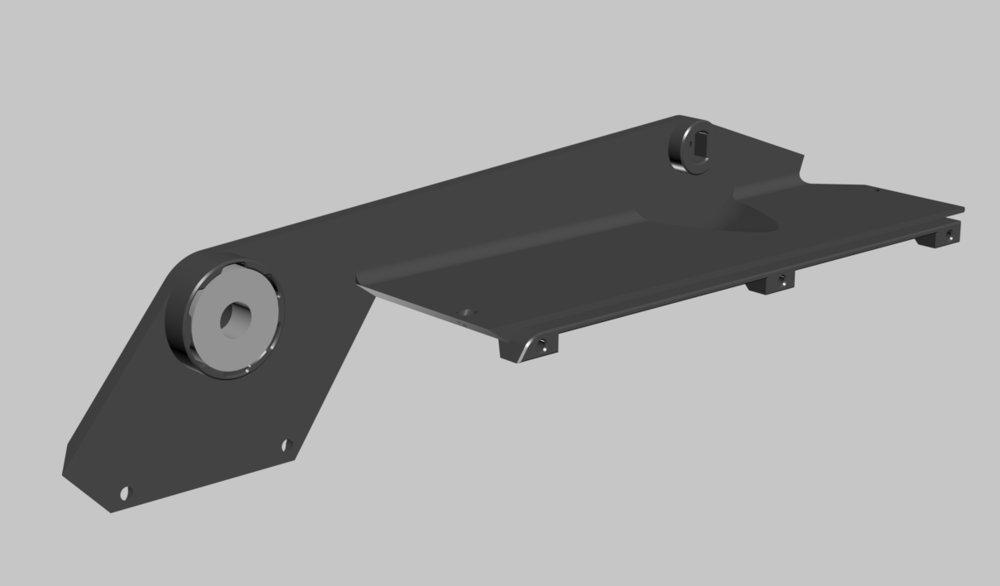

Nas peças [lane_0_left_base](STLs/filamentalist/lane_0_left_base.stl), [lane_0_right_base](STLs/filamentalist/lane_0_right_base.stl), [lane_1_left_base](STLs/filamentalist/lane_2_left_base.stl), [lane_1_right_base](STLs/filamentalist/lane_1_right_base.stl), [lane_2_left_base](STLs/filamentalist/lane_2_left_base.stl), [lane_2_right_base](STLs/filamentalist/lane_2_right_base.stl), [lane_3_left_base](STLs/filamentalist/lane_3_left_base.stl) e [lane_3_right_base](STLs/filamentalist/lane_3_right_base.stl), coloque um rolamento 608zz em cada.

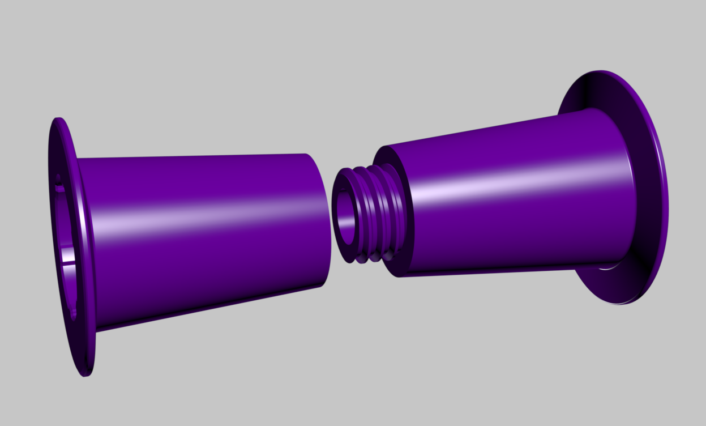

Junte as duas partes dos idlers [Idler_Roller_female](STLs/filamentalist/[a]Idler_Roller_(female)_x4.stl) e [Idler_Roller_male](STLs/filamentalist/[a]Idler_Roller_(male)_x4.stl).

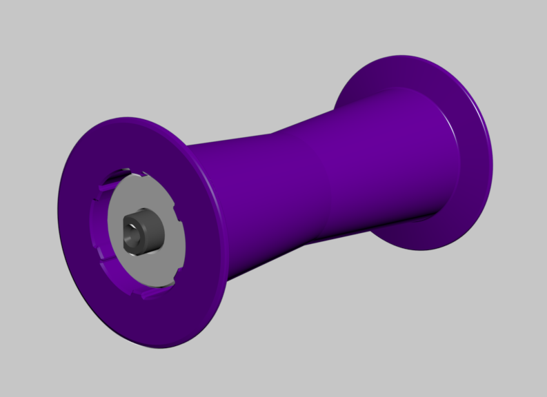

Coloque 2 rolamentos 608zz e insira o [Idler_Roller_Axle](STLs/filamentalist/Idler_Roller_Axle_x4.stl).

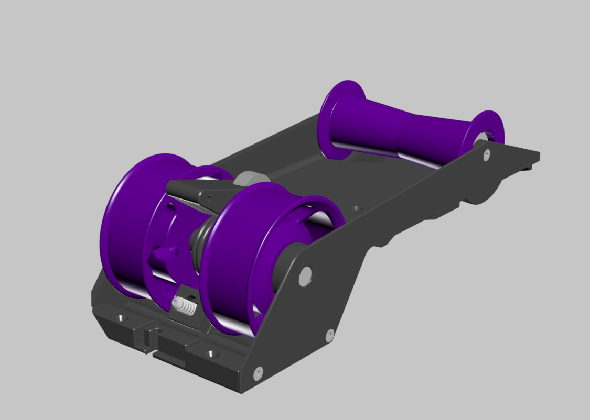

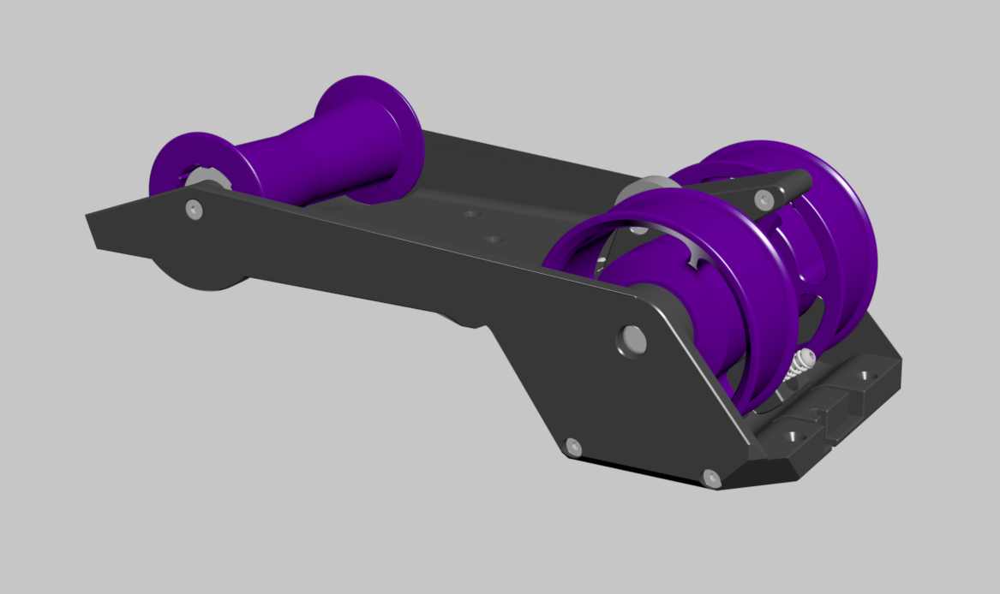

Agora, junte todas as peças. Fixe o Idler e o tensionador com 3 parafusos M3x10 FHCS de cada lado, na parte superior com 2 parafusos M2x10 BHCS e na parte inferior com 3 parafusos M2x10 BHCS.

## Montagem do Box

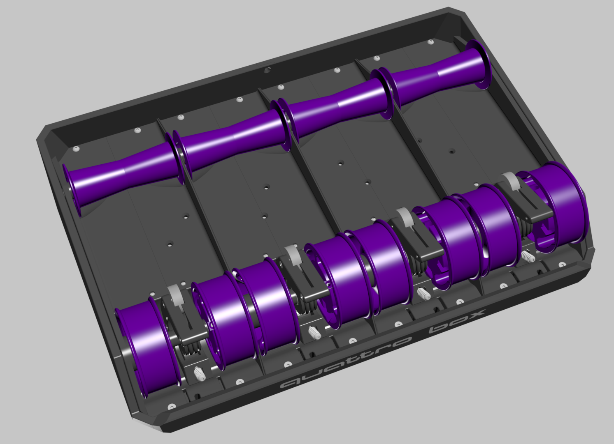

Monte os 4 Filamentalist na caixa utilizando 8 parafusos M3x16 FHCS na parte da frente e 8 parafusos M3x6 BHCS na parte de trás.

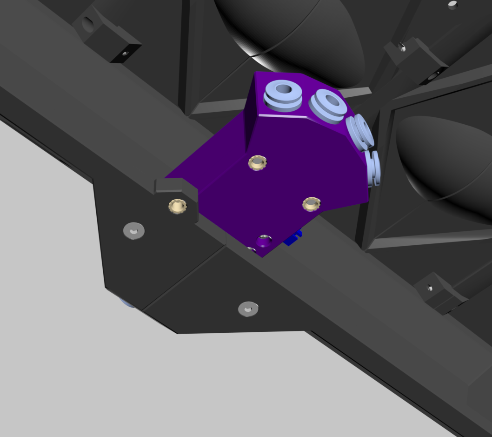

Monte o encoder na parte de baixo da caixa com 2 parafusos M3x8 FHCS.

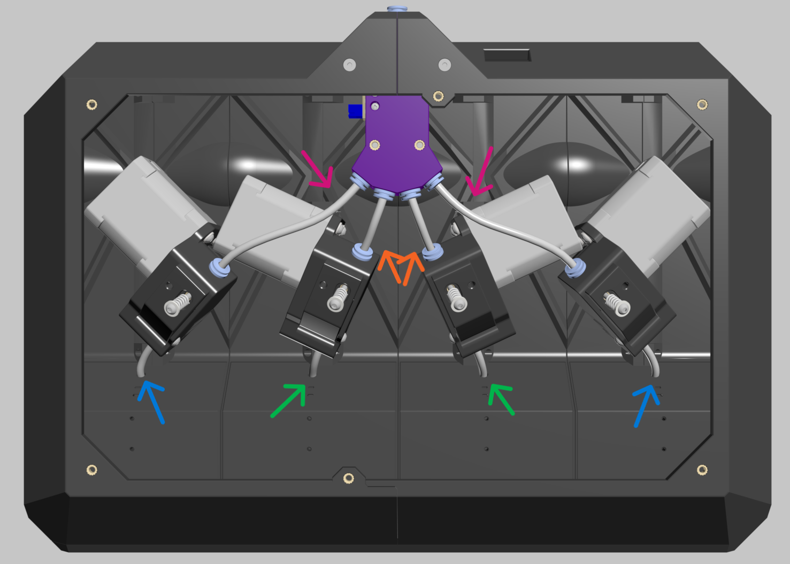

Separe os tubos de PTFE com os seguintes tamanhos:

- **Verde**: 2 x 54mm
- **Laranja**: 2 x 55mm
- **Azul**: 2 x 57mm
- **Rosa**: 2 x 109mm

Coloque os tubos de PTFE nas extrusoras e, em seguida, instale-as pela parte de baixo da caixa, encaixando os tubos de PTFE no Filamentalist e no encoder. Fixe as extrusoras com 2 parafusos M3x8 FHCS pela parte de cima.

Passe os cabos do LED pelos buracos na peça do Filamentalist. Não encaixe o botão ainda; deixe-o pendurado pelo cabo, pois você ainda precisa calibrar a pressão da mola.

Após montar e calibrar tudo, execute a macro `rewinder_test_move` com uma distância longa (ex: 1000mm) para verificar se o rebobinamento está funcionando corretamente.
- Se o spool estiver embolando ao puxar o filamento, afrouxe a mola.
- Se o spool não estiver rebobinando o filamento, aperte a mola.

Depois de calibrar a mola, encaixe o botão na base, tomando cuidado para não danificar os cabos no processo.

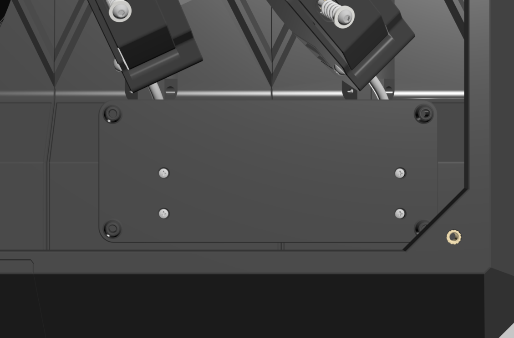

Monte a peça [MMB_mount](STLs/eletronic_mount/MMB_mount.stl) com 4 parafusos M2x10 BHCS.

Monte a BTT MMB no lugar indicado.

## Eletrônica

Ligue todos os cabos de acordo com o layout acima.

Existem vários lugares na caixa onde você pode usar abraçadeiras para organizar os cabos.

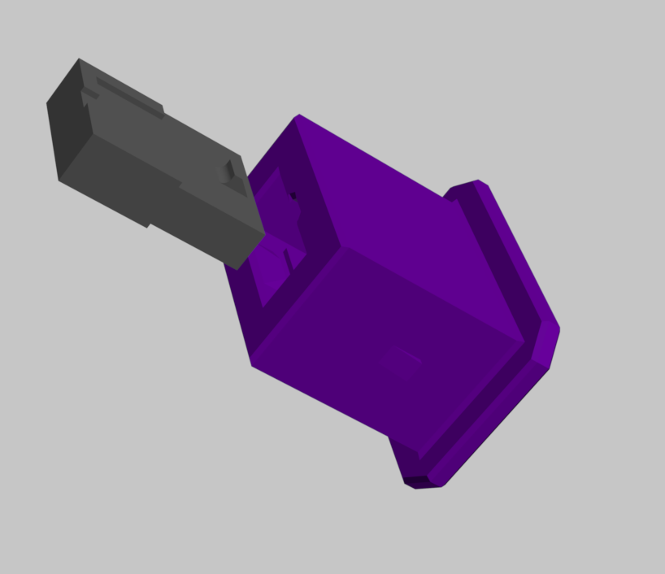

Caso deseje ligar a placa via CANBUS, há um plug de extensão que transforma o XT30+2 em microfit.

Para montá-lo, encaixe o microfit já com os cabos crimpados na peça [microfit_mount](STLs/eletronic_mount/[a]microfit_mount.stl).

Passe os cabos pelo buraco da caixa de fora para dentro e encaixe o [microfit_mount](STLs/eletronic_mount/[a]microfit_mount.stl).

Para montar o [tbox cover bottom](STLs/box/box_cover_bottom.stl), utilize M3x12 BHCS nas sapatas e 2 parafusos M3x8 FHCS no meio.

